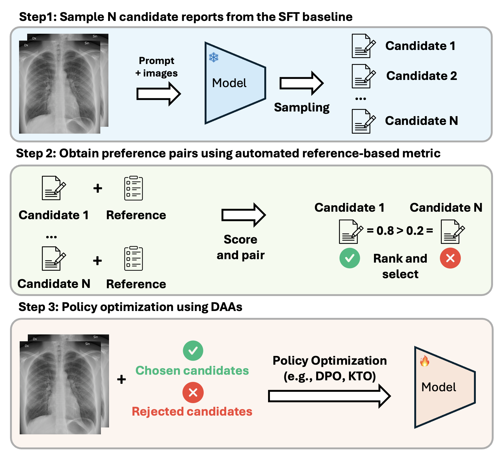

# 🤖 CheXalign: Preference fine-tuning in chest X-ray interpretation models without human feedback

Radiologists play a crucial role in translating medical images into actionable reports. However, the field faces staffing shortages and increasing workloads. While automated approaches using vision-language models (VLMs) show promise as assistants, they require exceptionally high accuracy. Most current VLMs in radiology rely solely on supervised fine-tuning. Meanwhile, additional preference fine-tuning in the post-training pipeline has become standard practice in the general domain. The challenge in radiology lies in the prohibitive cost of obtaining radiologist feedback at scale. To address this challenge, we propose an automated pipeline for preference feedback, focusing on chest X-ray radiology report generation (RRG). Specifically, our method leverages publicly available datasets containing pairs of images and radiologist-written reference reports with reference-based metrics, or Judges, eliminating the need for *additional radiologist feedback*. We investigate reward overoptimization via length exploitation in this setting and introduce a length-controlled version of the GREEN score. Our best-performing setup achieves state-of-the-art CheXbert scores on the MIMIC-CXR dataset for the RRG task while on average maintaining robust performance across six additional image perception and reasoning tasks.

<p align="center">
  
</p>

## 🚀 Getting Started

### Installation and data

Follow the instructions from [the alignment handbook](https://github.com/huggingface/alignment-handbook) for installation and [CheXagent](https://github.com/Stanford-AIMI/CheXagent) for data. 

### CheXalign 

#### Step 1: Sample N candidate reports from the SFT baseline

```shell
accelerate launch -m auxiliary_scripts.get_completions
```

#### Step 2: Obtain preference pairs using automated reference-based metric

Follow the installation instructions for [GREEN](https://github.com/Stanford-AIMI/GREEN) and then obtain scores in chunks for each completion: 

```shell
accelerate launch -m auxiliary_scripts.get_rewards_chunk
```

Then gather all chunks and completions:

```shell
python -m auxiliary_scripts.gather_chunks
```

Finally rank and sort to obtain preference pairs: 

```shell
python -m auxiliary_scripts.get_preference
```

#### Step 3: Policy optimization using DAAs
```shell
bash run.sh
```

## 📚 Citation

If you find this useful, please consider citing: 

```bibtex
@inproceedings{hein-etal-2025-chexalign,
    title = "{C}he{X}align: Preference fine-tuning in chest {X}-ray interpretation models without human feedback",
    author = "Hein, Dennis  and
      Chen, Zhihong  and
      Ostmeier, Sophie  and
      Xu, Justin  and
      Varma, Maya  and
      Reis, Eduardo Pontes  and
      Md, Arne Edward Michalson  and
      Bluethgen, Christian  and
      Shin, Hyun Joo  and
      Langlotz, Curtis  and
      Chaudhari, Akshay S",
    editor = "Che, Wanxiang  and
      Nabende, Joyce  and
      Shutova, Ekaterina  and
      Pilehvar, Mohammad Taher",
    booktitle = "Proceedings of the 63rd Annual Meeting of the Association for Computational Linguistics (Volume 1: Long Papers)",
    month = jul,
    year = "2025",
    address = "Vienna, Austria",
    publisher = "Association for Computational Linguistics",
    url = "https://aclanthology.org/2025.acl-long.1342/",
    pages = "27679--27702",
    ISBN = "979-8-89176-251-0",
    abstract = "Radiologists play a crucial role in translating medical images into actionable reports. However, the field faces staffing shortages and increasing workloads. While automated approaches using vision-language models (VLMs) show promise as assistants, they require exceptionally high accuracy. Most current VLMs in radiology rely solely on supervised fine-tuning. Meanwhile, additional preference fine-tuning in the post-training pipeline has become standard practice in the general domain. The challenge in radiology lies in the prohibitive cost of obtaining radiologist feedback at scale. To address this challenge, we propose an automated pipeline for preference feedback, focusing on chest X-ray radiology report generation (RRG). Specifically, our method leverages publicly available datasets containing pairs of images and radiologist-written reference reports with reference-based metrics, or Judges, eliminating the need for *additional radiologist feedback*. We investigate reward overoptimization via length exploitation in this setting and introduce a length-controlled version of the GREEN score. Our best-performing setup achieves state-of-the-art CheXbert scores on the MIMIC-CXR dataset for the RRG task while on average maintaining robust performance across six additional image perception and reasoning tasks."
}
```

## 🙏 Acknowledgments
This code base is built on [the alignment handbook](https://github.com/huggingface/alignment-handbook), [CheXagent](https://github.com/Stanford-AIMI/CheXagent) and [GREEN](https://github.com/Stanford-AIMI/GREEN). 
